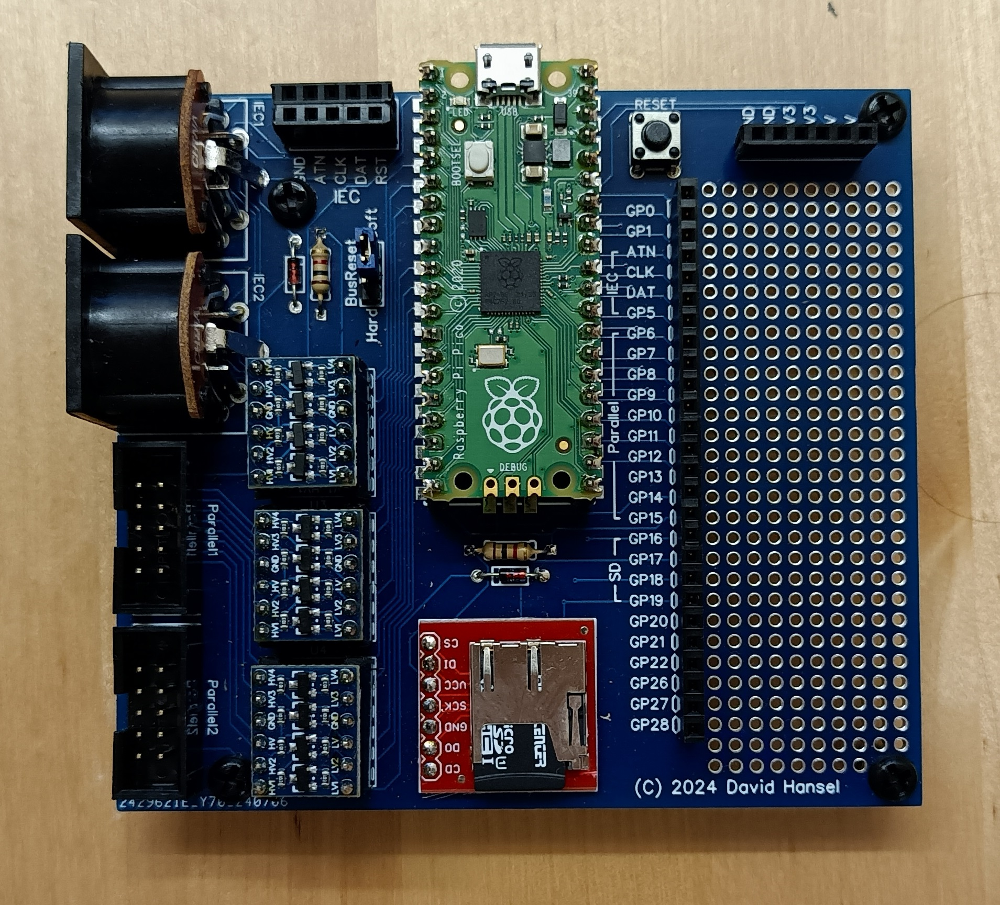
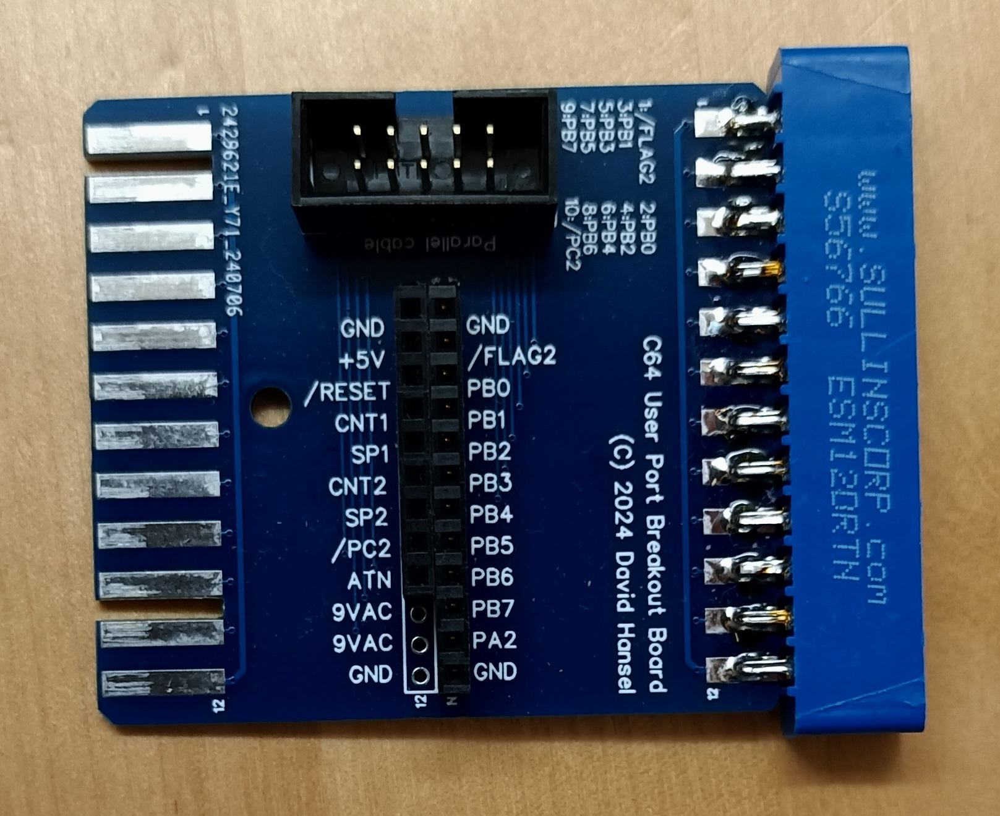

# Raspberry Pi Pico Development Board

While microcontrollers operating on 5V (such as the Arduino Uno) can be connected directly 
to the IEC bus and User Port, the Raspberry Pi Pico operates on 3.3V and therefore needs
voltage level converters. To make wiring easier (especially when also wiring a parallel
cable) I made a circuit board that can be used to easily connect the Pi Pico to your computer.

   

The [schematic](IECPiPicoSchematic.pdf), [PCB layout](IECPiPicoPCB.pdf) and
[Gerber file](IECPiPicoGerber.zip) for PCB production are provided in this directory.

Part                             |Count|Supplier | Part number
---------------------------------|-----|---------|----------------
Sparkfun MicroSD breakout board  |  1  | DigiKey | 1568-1345-ND
Raspberry Pi Pico                |  1  | DigiKey | SC0915
40-position header (female)      |  2  | DigiKey | 732-61304011821-ND
40-position header (male)        |  2  | DigiKey | S1012EC-40-ND
Level shifter                    |  3  | EBay    | https://www.ebay.com/itm/134140416433 or similar
Push Button                      |  1  | DigiKey | TS02-66-60-BK-160-LCR-D
Diode 1N4148                     |  2  | DigiKey | 1N4148FS-ND
Resistor 1kOhm                   |  2  | DigiKey | CF14JT1K00
6-pin DIN connector (serial bus) |  2  | DigiKey | CP-2360-ND
10-pin IDC socket                |  2  | DigiKey | ED1543-ND

Note that if you do not need/want to use the parallel connection for DolphinDos, 
you can leave the following components unpopulated:
  - Level shifters: U3 and U4
  - IDC sockets: parallel 1 and parallel 2
  - Diode D2
  - Resistor R2

The BusReset jumper allows to configure how the board reacts to a reset signal coming
from the IEC bus:
  - Not installed: no reset
  - Connecting middle pin and Hard: PiPico reset pin is pulled low

## User Port Breakout Board

For an easy connecting of the parallel cable to the C64 user port (while leaving
the user port itself available for the parallel cable coming from the C1541 disk drive),
you can use this user port breakout board and cable assembly:

   

The [schematic](UserPortBreakoutSchematic.pdf), [PCB layout](UserPortBreakoutPCB.pdf) and 
[Gerber file](UserPortBreakoutGerber.zip) for PCB production are provided in this directory.

Part                             |Count|Supplier | Part number
---------------------------------|-----|---------|----------------
24-position card edge connector  |  1  | DigiKey | S9701-ND
10-pin IDC socket                |  1  | DigiKey | ED1543-ND
10-pin push-on IDC connector     |  2  | DigiKey | ED10500-ND
10-conductor ribbon cable        |  1  | DigiKey | 19-3365/10-DS-ND
